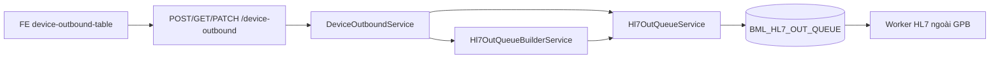

# Tài liệu: Màn Kết nối máy — HL7 Out Queue

**Phiên bản:** 2026-06  
**Màn hình FE:** `/device-outbound` (Kết nối máy)  
**Base API:** `/api/v1/device-outbound` (giữ URL cũ, persistence mới)  
**Bảng dữ liệu:** `BML_HL7_OUT_QUEUE` (thay thế `BML_DEVICE_OUTBOUND`)

---

## 1. Tổng quan nghiệp vụ

### 1.1 Mục tiêu

Khi người dùng bấm **Gửi** trên dialog **Tạo order**, hệ thống GPB **ghi một dòng vào hàng đợi HL7** (`BML_HL7_OUT_QUEUE`, `STATUS = 0`). Job/service bên ngoài đọc queue, build/gửi HL7 ra thiết bị, rồi cập nhật `STATUS`, `SENT_TIME`, `ERROR_MESSAGE`, `RETRY_COUNT`.

Người dùng có thể **hủy** một hoặc nhiều order trên màn list: GPB cập nhật `STATUS = 3` (không xóa dòng, không sửa các field khác).

GPB **không** gửi HL7 trực tiếp. Ngoài **tạo**, **hủy (status = 3)** và **cập nhật thông tin bệnh nhân (status = 4)**, GPB **không** sửa/xóa các field khác trên bản ghi queue.

### 1.2 Thay đổi so với phiên bản cũ

| Trước | Sau |
|--------|-----|
| Lưu `BML_DEVICE_OUTBOUND` | Chỉ `INSERT` `BML_HL7_OUT_QUEUE` |
| CRUD đầy đủ (sửa/xóa) | Chỉ **hủy** (`STATUS = 3`); không sửa field khác, không xóa |
| Payload response: `receptionCode`, `serviceCode`, `method` | Response từ queue: `lisCaseId`, `slideId`, `status`, `testVantageCode`, … |
| `method` nhập text tự do | `method` = `METHOD_NAME` từ `BML_DEVICE_STAINING_METHOD` (dropdown) |

### 1.3 Kiến trúc module (Backend)

```
AppModule
  └── Hl7OutQueueModule
        ├── Hl7OutQueueService          (enqueue, getList, getById, updatePatient, cancelBatch)
        ├── Hl7OutQueueBuilderService    (map field từ stored request + staining + user)
        ├── Hl7OutQueueRepository
        ├── DeviceOutboundController     (route /device-outbound)
        └── DeviceOutboundService      (orchestration)
```

- **`DeviceOutboundModule`** không còn đăng ký trong `AppModule` (deprecated).
- Entity `DeviceOutbound` / bảng `BML_DEVICE_OUTBOUND` **không dùng** cho luồng mới (file entity giữ lại với `@deprecated`).



---

## 2. Các task đã thực hiện

### 2.1 Backend — module HL7 Out Queue

| # | Task | File / ghi chú |
|---|------|----------------|
| 1 | Entity map `BML_HL7_OUT_QUEUE` | `src/modules/hl7-out-queue/entities/hl7-out-queue.entity.ts` |
| 2 | Repository: `save`, `findById`, `findByLisCaseId`, `findWithPagination` | `repositories/hl7-out-queue.repository.ts` |
| 3 | Service: `enqueue`, `getList`, `cancelBatch` | `hl7-out-queue.service.ts` |
| 4 | Utils: tách họ/tên, parse DOB, map giới tính M/F, hex ID RAW(16), công thức block/slide/specimen | `utils/*.ts` |
| 5 | `Hl7OutQueueBuilderService` — map đủ field theo spec nghiệp vụ | `hl7-out-queue-builder.service.ts` |
| 6 | DTO + mapper response list | `dto/responses/hl7-out-queue-list-item.dto.ts`, `hl7-out-queue.mapper.ts` |
| 7 | `Hl7OutQueueModule` export service + đăng ký controller/service device-outbound | `hl7-out-queue.module.ts` |

### 2.2 Backend — pivot API device-outbound

| # | Task | Ghi chú |
|---|------|--------|
| 8 | `POST` / `POST batch` → build + `enqueue` (transaction) | `device-outbound.service.ts` |
| 9 | `GET` list từ `BML_HL7_OUT_QUEUE`, lọc `receptionCode` → `LIS_CASE_ID` | |
| 10 | `GET /services` — giữ nguyên (dropdown dịch vụ) | |
| 11 | **Gỡ** `PUT`, `DELETE`, `GET :id` | `device-outbound.controller.ts` |
| 11b | **`PATCH /cancel-batch`** — cập nhật `STATUS = 3` cho nhiều bản ghi (transaction) | `cancel-device-outbound-batch.dto.ts`, `device-outbound.service.ts` |
| 12 | Bỏ `DeviceOutboundModule` khỏi `app.module.ts` | Chỉ còn `Hl7OutQueueModule` |
| 13 | Fix DI: `@Inject(Hl7OutQueueService)`, `@Inject(Hl7OutQueueBuilderService)`, `@Inject(DataSource)` | Tránh lỗi `getList`/`enqueue is not a function` |
| 14 | Bỏ `@Max(100)` trên `limit` API device-staining-methods | Dropdown phương pháp load đủ bản ghi |

### 2.3 Frontend

| # | Task | File |
|---|------|------|
| 15 | Cập nhật type `DeviceOutboundItem` theo queue | `fe-gpb/src/lib/api/client.ts` |
| 16 | `assertApiSuccess` — throw khi API `success: false` (toast lỗi đúng) | `client.ts` |
| 17 | `getDeviceStainingMethods` cho dropdown phương pháp | `client.ts` |
| 18 | Xóa API update/delete/getById | `client.ts` |
| 19 | Bảng list: Barcode, Slide, Block, PP, Trạng thái, Ngày tạo, Đã gửi, Lỗi | `device-outbound-table.tsx` |
| 20 | Dialog chỉ **Tạo order** + Gửi / batch; bỏ sửa/xóa | |
| 21 | Lọc list chỉ theo Barcode (bỏ lọc mã dịch vụ) | |
| 22 | Checkbox chọn nhiều bản ghi trên list + button **Hủy** cạnh **Tạo order** | `device-outbound-table.tsx` |
| 23 | `cancelDeviceOutboundBatch` — `PATCH /cancel-batch` | `client.ts` |
| 24 | Badge màu cột trạng thái: xanh **Đã gửi**, đỏ **Đã hủy** | `device-outbound-table.tsx` |

### 2.4 Lỗi đã xử lý trong quá trình triển khai

| Lỗi | Nguyên nhân | Cách xử lý |
|-----|-------------|------------|
| Dropdown phương pháp trống | FE gọi `limit=200`, BE `@Max(100)` | Bỏ max 100 trên BE; FE `limit=1000` |
| Toast "Thành công" khi API 500 | `apiClient` không throw khi `success: false` | `assertApiSuccess` trên create/batch/staining |
| `getList` / `enqueue is not a function` | Nest inject sai dependency (constructor thiếu `@Inject` rõ) | Inject tường minh từng dependency |
| Server vẫn lỗi sau restart | Process cũ chiếm port 8000 | Kill PID cũ, start lại một process |

---

## 3. Quy tắc nghiệp vụ khi Gửi order

### 3.1 Đầu vào từ form (API)

| Field | Mô tả |
|-------|--------|
| `receptionCode` | Mã Barcode / tiếp nhận |
| `serviceCode` | Mã dịch vụ (dropdown từ stored services) |
| `blockNumber` | Số block (≥ 1) |
| `slideNumber` | Số slide (≥ 1) |
| `method` | `METHOD_NAME` trong `BML_DEVICE_STAINING_METHOD` (bắt buộc tồn tại) |

### 3.2 Công thức ID

| Field queue | Công thức | Ví dụ |
|-------------|-----------|--------|
| `BLOCK_ID` | `{receptionCode}A.{blockNumber}` | `S2601.0312A.2` |
| `SLIDE_ID` | `{receptionCode}A.{blockNumber}.{slideNumber}` | `S2601.0312A.2.3` |
| `SPECIMEN_ID` | `{receptionCode}A` | `S2601.0312A` |
| `LIS_CASE_ID` | `receptionCode` | |
| `SPECIMEN_NUMBER` | `'A'` | |
| `ORDER_CONTROL` | `'NW'` | |

### 3.3 Map field từ database

| Cột `BML_HL7_OUT_QUEUE` | Nguồn |
|-------------------------|--------|
| `PATIENT_ID` | `String(BML_STORED_SERVICE_REQUESTS.PATIENT_ID)` |
| `PATIENT_FAMILY` / `PATIENT_GIVEN` | Tách `PATIENT_NAME` (token đầu = họ, còn lại = tên) |
| `PATIENT_DOB` | `PATIENT_DOB` (number → Date, 8 chữ số YYYYMMDD) |
| `PATIENT_GENDER` | `M` / `F` — map từ `PATIENT_GENDER_ID` (1 → `F`, 2 → `M`); fallback `PATIENT_GENDER_NAME` (`Nam`/`Nữ`) qua `mapPatientGenderToHl7` |
| `PHYSICIAN_ID` | `REQUEST_LOGINNAME` |
| `PHYSICIAN_FAMILY` / `PHYSICIAN_GIVEN` | Tách `REQUEST_USERNAME` |
| `REGISTRATION_DATE` | `INSTRUCTION_TIME` |
| `TEST_CODE` | `BML_DEVICE_STAINING_METHOD.PROTOCOL_NO` (theo `method`) |
| `TEST_VANTAGE_CODE` | `BML_DEVICE_STAINING_METHOD.METHOD_NAME` |
| `TEST_DESCRIPTION` | `BML_STORED_SR_SERVICES.SERVICE_NAME` |
| `TISSUE_NAME` | `SAMPLE_TYPE_NAME` trên dòng DV, hoặc join `BML_SAMPLE_TYPES` |
| `TEST_FLAG_NAME` / `TISSUE_SUB_NAME` | `BML_STAINING_METHOD.METHOD_NAME` (theo `stainingMethodId` phiếu) |
| `GROSS_DESCRIPTION_TEXT` | `htmlToPlainText(RESULT_COMMENT)` — bỏ thẻ HTML, plain text một dòng |
| `APPROVE_PHYSICIAN_ID` | `username` user đang đăng nhập |
| `APPROVE_PHYSICIAN_FAMILY` / `APPROVE_PHYSICIAN_GIVEN` | Tách `FULL_NAME` từ `BML_USERS` (user đăng nhập) |
| `PATHOLOGIST_ID` / `PATHOLOGIST_FAMILY` / `PATHOLOGIST_GIVEN` | `null` (không gán) |
| `RECEIVED_DATE` và các field còn lại (message, slides JSON, …) | `null` |
| `STATUS` | `0` |
| `RETRY_COUNT` | `0` |

### 3.4 Batch

- Một request `POST /device-outbound/batch` → N dòng queue (cùng `receptionCode`, `serviceCode`; mỗi item khác `blockNumber`/`slideNumber`/`method`).
- Thực hiện trong **một transaction**: một item lỗi → rollback toàn bộ.

### 3.5 Trạng thái queue (tham chiếu cho UI / worker)

| `STATUS` | Ý nghĩa trên UI | Ghi chú |
|----------|------------------|---------|
| `0` | Chờ gửi | Worker poll và xử lý |
| `1` | Đã gửi | Worker cập nhật sau khi gửi HL7 thành công; badge **xanh** trên FE |
| `3` | Đã hủy | GPB cập nhật khi user bấm **Hủy**; badge **đỏ** trên FE |
| `4` | Đã cập nhật BN | GPB sau `PATCH :id/patient`; badge **vàng/amber** trên FE |
| Khác | Hiển thị giá trị số | — |

### 3.6 Cập nhật thông tin bệnh nhân

- User bấm **Cập nhật** trên một dòng list → `GET /device-outbound/:id` load form.
- Nhập **Họ**, **Tên**, **Ngày sinh**, **Giới tính** (HL7 `M`/`F`) → `PATCH /device-outbound/:id/patient`.
- GPB cập nhật `PATIENT_FAMILY`, `PATIENT_GIVEN`, `PATIENT_DOB`, `PATIENT_GENDER` và set **`STATUS = 4`**.
- **Không cho phép** khi `status = 3` (Đã hủy).
- Cho phép cập nhật khi `status` là `0`, `1`, `4`, …

### 3.7 Hủy order (batch)

- User chọn một hoặc nhiều dòng trên bảng list bằng **checkbox** (có checkbox "chọn tất cả" trên trang hiện tại).
- Bấm **Hủy** → `PATCH /device-outbound/cancel-batch` với `{ ids: string[] }`.
- Mỗi `id` là **hex 32 ký tự** (PK `RAW(16)`).
- Hủy được **mọi trạng thái hiện tại** (`0`, `1`, …) — luôn set `STATUS = 3`.
- Thực hiện trong **một transaction**: một id không tồn tại → rollback toàn bộ, trả 404.
- Sau thành công: refresh list, xóa selection, toast số lượng đã hủy.
- Đổi trang hoặc lọc Barcode → xóa selection.

---

## 4. API Backend

**Auth:** `Authorization: Bearer <JWT>`  
**Ghi (POST, PATCH cancel-batch, PATCH :id/patient):** bắt buộc JWT (HIS token không được phép).  
**Đọc (GET list/services/:id):** `DualAuthGuard` (JWT hoặc HIS tùy cấu hình guard).

### 4.1 POST — Gửi một order

```
POST /api/v1/device-outbound
```

**Body:**

```json
{
  "receptionCode": "S2601.0312",
  "serviceCode": "BM125",
  "blockNumber": 2,
  "slideNumber": 3,
  "method": "HE"
}
```

**Response 201 — `data`:**

```json
{
  "id": "A1B2C3D4E5F67890123456789ABCDEF01",
  "lisCaseId": "S2601.0312",
  "slideId": "S2601.0312A.2.3",
  "blockId": "S2601.0312A.2",
  "testVantageCode": "HE",
  "testCode": "PROTO-001",
  "status": 0,
  "createdTime": "2026-05-26T16:30:00.000Z",
  "sentTime": null,
  "errorMessage": null,
  "retryCount": 0
}
```

> `id` là **hex 32 ký tự** (PK `RAW(16)`), không phải UUID 36 ký tự.

**Lỗi thường gặp:**

| HTTP | Message |
|------|---------|
| 400 | Thiếu field, `method` không có trong `BML_DEVICE_STAINING_METHOD` |
| 404 | Không tìm thấy dòng dịch vụ theo `receptionCode` + `serviceCode` |
| 400 | Nhiều hơn một dòng dịch vụ trùng `serviceCode` |

### 4.2 POST — Gửi batch

```
POST /api/v1/device-outbound/batch
```

**Body:**

```json
{
  "receptionCode": "S2601.0312",
  "serviceCode": "BM125",
  "items": [
    { "blockNumber": 1, "slideNumber": 1, "method": "HE" },
    { "blockNumber": 1, "slideNumber": 2, "method": "HE" }
  ]
}
```

**Response 201:** mảng `DeviceOutboundResponseDto[]`.

### 4.3 GET — Danh sách queue

```
GET /api/v1/device-outbound?limit=20&offset=0&receptionCode=S2601.0312
```

| Query | Mô tả |
|-------|--------|
| `limit` | 1–100, mặc định 10 |
| `offset` | Mặc định 0 |
| `receptionCode` | Lọc theo `LIS_CASE_ID` (optional) |

**Response 200 — `data`:**

```json
{
  "items": [ /* DeviceOutboundResponseDto[] */ ],
  "pagination": {
    "total": 100,
    "limit": 20,
    "offset": 0,
    "has_next": true,
    "has_prev": false
  }
}
```

### 4.4 GET — Dịch vụ theo Barcode (dropdown)

```
GET /api/v1/device-outbound/services?receptionCode=S2601.0312
```

**Response 200:** mảng `{ id, serviceCode, serviceName, isChildService, parentServiceId }`.

### 4.5 PATCH — Hủy nhiều order (batch)

```
PATCH /api/v1/device-outbound/cancel-batch
```

**Body:**

```json
{
  "ids": [
    "A1B2C3D4E5F6789012345678ABCDEF01",
    "B2C3D4E5F6789012345678ABCDEF0123"
  ]
}
```

| Field | Mô tả |
|-------|--------|
| `ids` | Mảng không rỗng; mỗi phần tử là hex 32 ký tự (`0-9`, `a-f`, `A-F`) |

**Response 200 — `data`:** mảng `DeviceOutboundResponseDto[]` (các bản ghi sau khi hủy, `status: 3`).

**Lỗi thường gặp:**

| HTTP | Message |
|------|---------|
| 400 | `ids` rỗng hoặc id không đúng định dạng hex 32 ký tự |
| 404 | Một hoặc nhiều id không tồn tại trong `BML_HL7_OUT_QUEUE` |
| 400 | Thiếu JWT (HIS token không được phép) |

### 4.6 GET — Chi tiết một bản ghi (kèm BN)

```
GET /api/v1/device-outbound/:id
```

| Param | Mô tả |
|-------|--------|
| `id` | Hex 32 ký tự (PK `RAW(16)`) |

**Response 200 — `data`:** `DeviceOutboundDetailResponseDto` — các field list + `patientFamily`, `patientGiven`, `patientDob` (`YYYY-MM-DD`), `patientGender` (`M`/`F`).

**Lỗi:** 400 (id không hợp lệ), 404 (không tìm thấy).

### 4.7 PATCH — Cập nhật thông tin bệnh nhân

```
PATCH /api/v1/device-outbound/:id/patient
```

**Body:**

```json
{
  "patientFamily": "Nguyễn",
  "patientGiven": "Văn A",
  "patientDob": "1984-09-07",
  "patientGender": "M"
}
```

**Response 200 — `data`:** `DeviceOutboundDetailResponseDto` với `status: 4`.

**Lỗi thường gặp:**

| HTTP | Message |
|------|---------|
| 400 | Validation lỗi, id không hợp lệ, hoặc `status = 3` (đã hủy) |
| 404 | Không tìm thấy bản ghi |
| 400 | Thiếu JWT |

### 4.8 API đã gỡ (cũ)

| Method | URL | Lý do |
|--------|-----|--------|
| `PUT` | `/device-outbound/:id` | Thay bằng `PATCH :id/patient` (chỉ sửa BN) |
| `DELETE` | `/device-outbound/:id` | Không xóa queue |

### 4.9 API phụ trợ — Danh sách phương pháp thiết bị

```
GET /api/v1/device-staining-methods?limit=1000&offset=0
```

Dùng cho dropdown **Phương pháp** trên FE (không còn giới hạn `limit ≤ 100`).

---

## 5. Frontend

**Route:** `/device-outbound`  
**Component:** `fe-gpb/src/components/device-outbound/device-outbound-table.tsx`

### 5.1 Luồng người dùng

1. Mở màn **Kết nối máy** → xem danh sách queue (phân trang, lọc Barcode).
2. **Tạo order** → nhập Barcode → chọn dịch vụ → block/slide → chọn phương pháp (dropdown).
3. (Tuỳ chọn) **Thêm slide** vào danh sách trong dialog.
4. **Gửi** — single hoặc batch (theo checkbox chọn slide trong dialog).
5. Thành công → đóng dialog, refresh list. Lỗi → toast đỏ với message từ API.
6. Trên bảng list: chọn một hoặc nhiều dòng bằng **checkbox** → bấm **Hủy** (cạnh **Tạo order**) → `status` thành `3`, list refresh.
7. Cột **Thao tác**: bấm **Cập nhật** → dialog sửa BN → **Lưu** → `status` thành `4`, list refresh.
8. Cột **Trạng thái**: **Đã gửi** (badge xanh), **Đã hủy** (badge đỏ), **Đã cập nhật BN** (badge vàng); **Chờ gửi** hiển thị text thường.

### 5.2 Client API (`apiClient`)

| Method | Mô tả |
|--------|--------|
| `getDeviceOutboundList` | GET list |
| `createDeviceOutbound` | POST single (throw nếu lỗi) |
| `createDeviceOutboundBatch` | POST batch (throw nếu lỗi) |
| `cancelDeviceOutboundBatch` | PATCH cancel-batch (throw nếu lỗi) |
| `getDeviceOutboundById` | GET chi tiết (kèm BN) |
| `updateDeviceOutboundPatient` | PATCH cập nhật BN (throw nếu lỗi) |
| `getDeviceOutboundServices` | GET services |
| `getDeviceStainingMethods` | GET phương pháp cho dropdown |

---

## 6. Cấu trúc mã nguồn tham chiếu

```
gpb/src/modules/hl7-out-queue/
├── entities/hl7-out-queue.entity.ts
├── hl7-out-queue.service.ts
├── hl7-out-queue-builder.service.ts
├── hl7-out-queue.mapper.ts
├── hl7-out-queue.module.ts
├── repositories/hl7-out-queue.repository.ts
├── interfaces/hl7-out-queue.repository.interface.ts
├── dto/responses/hl7-out-queue-list-item.dto.ts
└── utils/
    ├── split-person-name.ts
    ├── parse-patient-dob.ts
    ├── map-patient-gender-to-hl7.ts
    ├── hl7-queue-id.util.ts
    └── device-outbound-ids.util.ts

gpb/src/modules/device-outbound/          # Controller + Service + DTO (giữ path API)
├── device-outbound.controller.ts
├── device-outbound.service.ts
├── dto/commands/cancel-device-outbound-batch.dto.ts
├── device-outbound.module.ts             # Không import AppModule
└── entities/device-outbound.entity.ts    # @deprecated

fe-gpb/src/components/device-outbound/
└── device-outbound-table.tsx
```

---

## 7. Phạm vi ngoài GPB (worker HL7)

GPB **INSERT** queue (`STATUS = 0`), có thể **hủy** (`STATUS = 3`) và **cập nhật BN** (`STATUS = 4`). Worker/service ngoài cần:

1. Poll `BML_HL7_OUT_QUEUE` where **`STATUS IN (0, 4)`** (có index `IDX_HL7_STATUS`).
2. **Bỏ qua** bản ghi `STATUS = 3` (đã hủy) và `STATUS = 1` (đã gửi).
3. Build/gửi HL7 theo field đã lưu.
4. Cập nhật `STATUS`, `SENT_TIME`, `ERROR_MESSAGE`, `RETRY_COUNT` (và `IDX_OUT_RETRY` nếu retry).

---

## 8. Kiểm thử gợi ý

| # | Case | Kỳ vọng |
|---|------|---------|
| 1 | Gửi single hợp lệ | 1 dòng queue, `status=0`, `slideId`/`blockId` đúng công thức |
| 2 | Gửi batch 3 slide | 3 dòng; rollback nếu `method` không tồn tại |
| 3 | List lọc `receptionCode` | Chỉ bản ghi `lisCaseId` khớp |
| 4 | Dropdown phương pháp | Load từ `device-staining-methods` |
| 5 | API lỗi | FE toast lỗi, không toast thành công |
| 6 | Không có PUT/DELETE | 404 hoặc route không tồn tại |
| 7 | Hủy 1 bản ghi | `status=3`, badge đỏ **Đã hủy** |
| 8 | Hủy nhiều bản ghi (status 0 và 1) | Tất cả `status=3` trong một request |
| 9 | Checkbox chọn tất cả | Chỉ chọn bản ghi trang hiện tại |
| 10 | Đổi trang / lọc | Selection bị xóa |
| 11 | Hủy id không tồn tại | 404, không cập nhật bản ghi nào (rollback) |
| 12 | Cập nhật BN hợp lệ | `status=4`, badge **Đã cập nhật BN** |
| 13 | Cập nhật BN khi `status=3` | Nút disabled / API 400 |
| 14 | GET :id | Trả đủ 4 field BN |

---

## 9. Tài liệu liên quan (có thể lỗi thời)

- [`device-outbound-api-for-frontend.md`](./device-outbound-api-for-frontend.md) — mô tả API **cũ** (BML_DEVICE_OUTBOUND, CRUD đầy đủ, field response cũ). **Không** có `PATCH cancel-batch`.
- [`device-outbound-batch-api-for-frontend.md`](./device-outbound-batch-api-for-frontend.md) — batch tạo order cũ; payload request vẫn tương thích, **response đã đổi**.

**Tài liệu chính thức cho luồng HL7 Out Queue:** file này (`ket-noi-may-hl7-out-queue.md`), bao gồm tạo order, hủy batch (`STATUS = 3`), và UI list.

---

## 10. Checklist triển khai / vận hành

- [ ] Bảng `BML_HL7_OUT_QUEUE` tồn tại trên schema GPB kết nối (LIS_RS / LIS_DEV).
- [ ] Có dữ liệu `BML_DEVICE_STAINING_METHOD` cho dropdown.
- [ ] Backend chạy **một** process trên port API (tránh process cũ).
- [ ] Sau deploy: `npm run build` + restart (không chỉ save file `.ts` khi dùng `start:prod`).
- [ ] Worker HL7 đọc queue đã được triển khai và test end-to-end với GPB.
